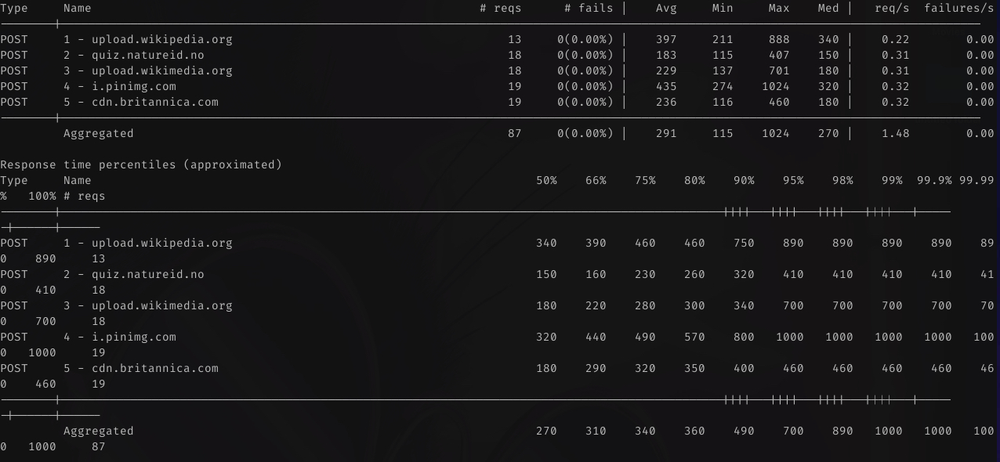
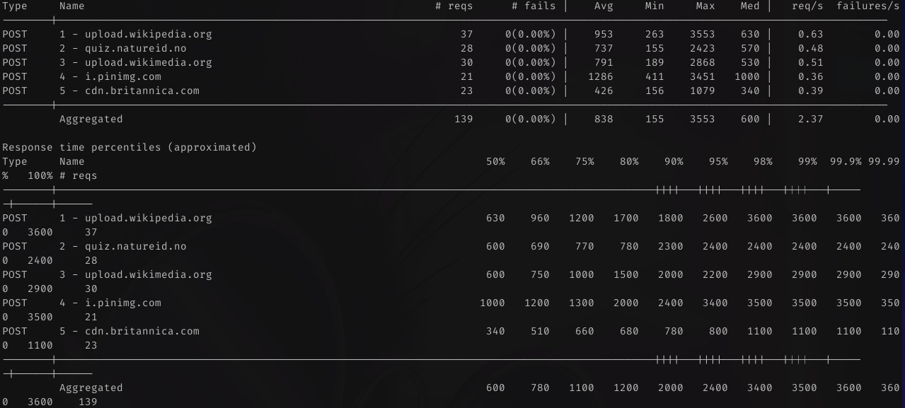
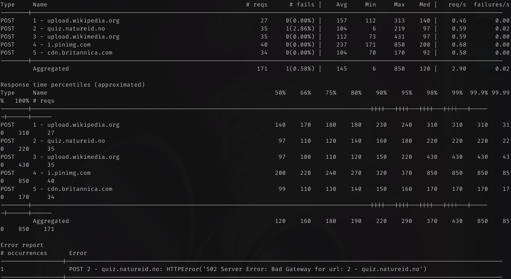

# Bird Model
This model receives the image of a bird and returns the top 3 most probable species.

## Setup needed infrastructure and services

### Needed utilities

* [KinD](https://kind.sigs.k8s.io/)
* [Helm](https://helm.sh/)
* [Kubectl](https://kubernetes.io/docs/tasks/tools/#kubectl)
* [PSQL](https://www.postgresql.org/docs/current/app-psql.html)
* [PyEnv](https://github.com/pyenv/pyenv)
* [PyEnv Virtualenv](https://github.com/pyenv/pyenv-virtualenv)

### How to setup the environment

1. Set the python version with `pyenv local 3.9.5`
2. Crate a virtualenv with `pyenv virtualenv <NAME>`
3. Remove the .python-version file with `rm .python-version`
4. Create a new .python-version file with `echo <NAME> > .python-version`, using the same name as above.
5. Install dev dependencies with `pip install -r dev-requirements.txt`

**Obs.: Using a virtualenv this way is practical since it'll activate it everytime you cd into the folder but it might cause some issues with the IDEs not recognizing the virtualenv**

### How to spin up everything

From the root folder run

```shell
./setup_infra_and_services.sh
```

This should spin up the KinD cluster and all needed services:
  * Elasticsearch (Observability)
  * Kibana (Observability)
  * Logstash (Observability)
  * Filebeat (Observability)
  * Metricbeat (Observability)
  * PostgreSQL (Model Registry)
  * Nginx Ingress Controller (Ingress Controller)

### How to initialize the Model Registry DDLs

**Obs.: The default password is `password`**
From the root folder we can follow the next steps:

  1. On one terminal we need to port-forward our k8s service

```shell
kubectl port-forward --namespace model-registry svc/model-registry-postgresql 5432:5432
```
  2. On another terminal, we need to run the `services/model_registry/migrations/initial_setup.sql` file

```shell
psql --host localhost --port 5432 -d registry -U postgres \
  -f services/model_registry/migrations/initial_setup.sql
```
  3. We can check the database by connecting to it

```shell
psql --host localhost --port 5432 -d registry -U postgres
```

We need to use port-forward since a Database connection uses a TCP protocol, but the Ingress Controller only routes HTTP the way it's configured. It seems that it could be achieved by tweaking our ingress configuration a little bit: [docs](https://kubernetes.github.io/ingress-nginx/user-guide/exposing-tcp-udp-services/)

### How to Build the Application
Our application runs as a Docker Container inside Kubernetes. We're also using the public docker hub for hosting our images.

1. Login into docker hub with `docker login`
2. Build the image with the wanted tag with `docker build . -t <USERNAME>/<IMAGE_NAME>:<VERSION>`
3. Push the image with `docker push <USERNAME>/<IMAGE_NAME>:<VERSION>`, using the same values from the command above.

### How to Deploy the Application

We're currently deploying the application manually using some Python Scripts for testing purposes.

1. Run `python scripts/test-app/deploy.py <MODEL-NAME> <IMAGE> <VERSION>`

**Obs.: In order to run with the given code, only <MODEL-NAME> needs to be passed**

### How to Access the logs through Kibana

**Obs.: This should be done after everything is setup and the logs from Logstash are already arriving on ElasticSearch.**

1. Accessing <http://kibana.localhost> we can open the left side menu and scroll down until we find **Stack Management**
2. When in **Stack Management** we can check the left side menu for **Index Patterns**
3. Clicking in **Create index pattern** we can just add `logstash*` to the Name field and `@timestamp` to the Timestamp field and create it.
4. Opening the left side menu and clicking in **Logs** we can then click the **Settings** button on the top right.
5. Once within the **Settings** screen, we can look for **Indices** and click on **Use Kibana index patterns** in order to select the one we've just created and then click on **Apply**
6. The logs should appear on the **Log Stream** now or you could explore them on the **Discovery** page.
7. You can filter application logs by adding `kubernetes.annotations.isModel : *` as a filter

## How to test the Application

**Obs.: Since we're running all tests locally, it can vary depending on the used computer configuration and on the current load.**

* Simple test

To run a small battery just run `python examples/examples.py`.

* Load testing with locust

To run some load tests we can use [locust](https://locust.io/)

```shell
locust --headless --users 5 --spawn-rate 1 -t 60s -H localhost -f examples/load_test.py
```



```shell
locust --headless --users 10 --spawn-rate 2 -t 60s -H localhost -f examples/load_test.py
```





## How to tear down everything

From the root folder run

```shell
./tear_down_infra_and_services.sh
```
